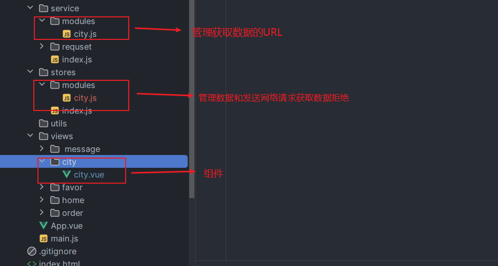

#### 修改第三方UI组件库的样式

- :deep(子组件的选择器){ 
}可以修改子组件的样式

##### 跳转到city页面，需要隐藏下面的额tabbar

- 1.useRoute()获取当前活跃的路由，通过设置meta属性，来v-if判断显示隐藏
> vue文件
> ```vue
> <script setup="">
>   import {useRoute} from "vue-router";
>
>   const route = useRoute() //获取当前路由
> </script>
>
> <template>
>   <son v-if="!route.meta.HideTabbar"></son>
> </template>
> 
><style scoped>
></style>
> ```
> 路由文件设置
> ```javascript
> {
>   path:'/city',
>   component:()=>import("../views/city/city.vue"),   //路由懒加载
>   meta:{
>       HideTabbar:true
>   }
> }
> ```

- 2.通过CSS
```css
.top-tabbar-hide{
    position:relative;
    z-index: 9;
    height: 100vh;
    background-color: #fff;
    
    overflow-y: auto;
    /* 在当前页面滚动，*/
}
```


#### 发送网络请求axios
- 封装axios  service/request/index.js

  - 网络请求
     - 1.在组件内部使用
       - 在组件内部进行网络请求,直接使用封装的axios
         ```javascript
            import AxRequest from '../../service/requset/index.js'
              AxRequest.get({
                url:'/city/all'
              }).then(res=>{
                console.log(res)
              }).catch(err=>{
                console.log(err)
              })
         ```
         - 外部封装，import引入使用，需要更改时在对应的外部封装文件就可以修改
           ```javascript
              import { getAllCity }  from '@/service'
                    const allCity=ref()
                    getAllCity().then(res=>{
                    console.log(res)
                    allCity.value = res.data
              })
           ```
     - 2.在状态管理Pinia使用
         